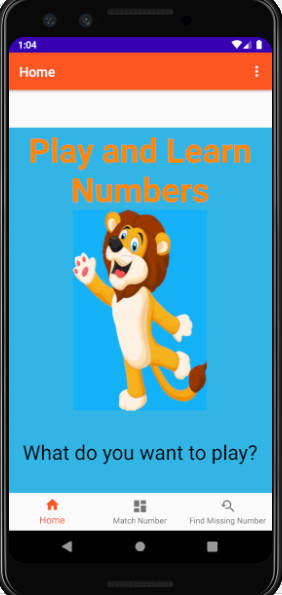
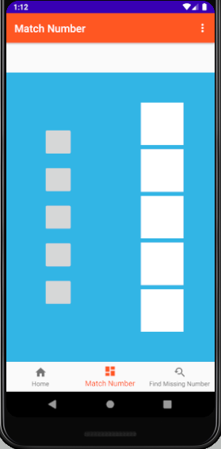

### Launch
   * Start the by launching the Play Numbers icon. 
   
   
   
   * If this is first time the app is launched after installation, a request for a Google Sign In account appears.
     This access is required to open the app. There is the option to Sign Out as well. 
     
     
   
   * After entering the app there is the home screen with a bottom navigation that allows the user
    to choose the type of the activity they want to try: **Matching Numbers** or **Missing Numbers**   
    
   . 
    
   * Chosen type of activity will lead to and screen with the list of activities of that type. 
      Currently, the screen show just the fragment of a future activity in the list of Matching Numbers and as well for Missing Numbers. 
      
      .
      
   *  Pressing the activity will lead the user to the screen with an actual activity. 
      The activity consists on connecting the number with the right image. 
      Currently, it is a empty fragment that will be filled with data. 
      
       